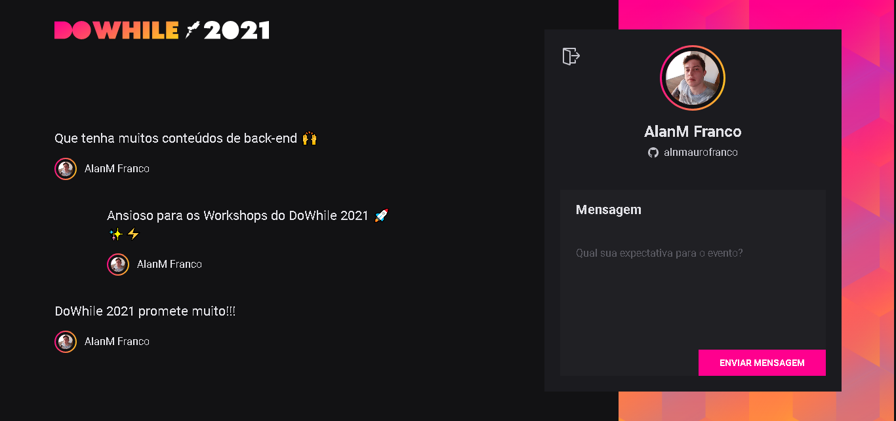

<h1 align="center" style="font-weight: bold;">
Heat - 🎓 Next Level Week 🚀
</h1>

<a href="https://heat-web.vercel.app/">https://heat-web.vercel.app</a>

## 🚀 Tecnologias
* [React](https://reactjs.org/) - A JavaScript library for building user interfaces
* [Vite](https://vitejs.dev/) - Next Generation Frontend Tooling
* [Typescript](https://www.typescriptlang.org/) - Typed JavaScript at Any Scale.
* [Socket.io](https://socket.io/) - Bidirectional and low-latency communication for every platform

## 🎉 Funcionalidades
* Autenticação do usuário com GitHub ✅
* Enviar mensagem ✅
* Listagem de mensagens ✅
* Perfil de usuário ✅

## ✅ Demostração

## 💫 Desafios - Próximo nível

- [x] Deploy na Vercel

## ⚡ Back-end
<a href="https://github.com/alnmaurofranco/heat-api">https://github.com/alnmaurofranco/heat-api</a>

---
Feito com 💚 by AlanM Franco
